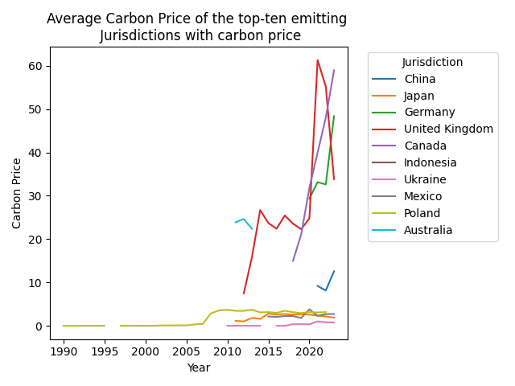
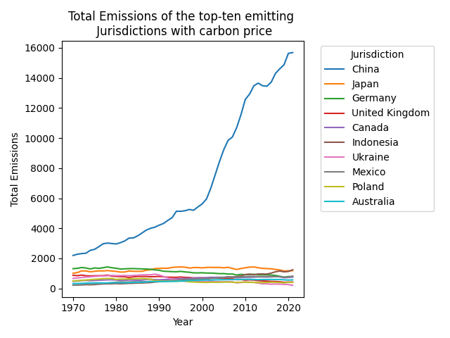

# Exercise Badges

    

# Methods of Advanced Data Engineering (MADE SS24)

This repository contains my project work and exercise submissions for the course "MADE" in the summer semester 2024 at the FAU.

## Project Work - Evaluation of the effectiveness of carbon pricing in greenhouse gas emission reduction
In my project I want to evaluate the effectiveness of carbon pricing in greenhouse gas emission reduction. I will use the World Bank's Carbon Pricing Dashboard and the Emissions Database for Global Atmospheric Research as data sources. For more information about the used data, please see my [data report](project/data-report.md). 
<table>
<tr>
<td></td>
<td></td>
</tr>
</table>
The project aims to answer the question: How effective are carbon pricing policies in reducing greenhouse gas emissions?
The results can be seen in the [final report](project/final-report.md).

## Exercises

The exercise submitions are placed in the `exercises` folder. Each exercise submission is named `excercise<number>.jy`. The exercise submitions are checked by the automated tests. The results of the tests can be seen in the badges above.