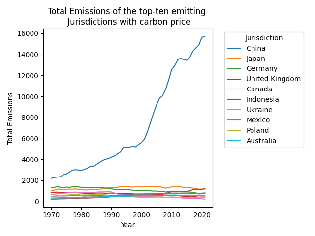
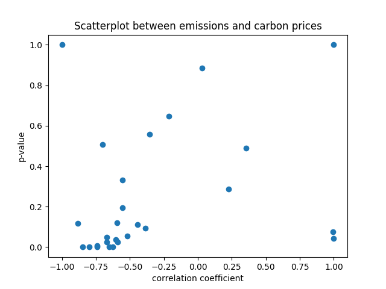

# Effectiveness of Carbon Pricing Policies in Reducing Greenhouse Gas Emissions
## Introduction
As the effects of climate change become more apparent, governments around the world are looking for ways to reduce greenhouse gas emissions. One method is carbon pricing, which places a price on carbon emissions to encourage companies to reduce their emissions. However, the effectiveness of carbon pricing policies in reducing greenhouse gas emissions is still a matter of debate. In this project, I aim to investigate the effectiveness of carbon pricing in reducing greenhouse gas emissions. The objective of this study is to determine the effectiveness of carbon pricing policies in reducing greenhouse gas emissions.
## Used Data
In order to answer this query, it is necessary to obtain data on carbon pricing initiatives and data on greenhouse gas emissions on a global scale. To this end, my data pipeline generates a SQLite database comprising two tables: one for the carbon pricing data and one for the greenhouse gas emissions data. 

The carbon pricing data includes information on carbon pricing initiatives around the world, such as the name of the carbon pricing initiative, the country implementing the policy, the price per tonne of CO2 and some statistical information about the country. The data available varies because the pricing initiatives start very individually, but all within the years 1990-2024. The data is published in the [World Bank's Carbon Pricing Dashboard](https://carbonpricingdashboard.worldbank.org/) under the Creative Commons Attribution 4.0 International [Licence](https://datacatalog.worldbank.org/public-licenses?fragment=cc).

The emission data includes greenhouse gas emissions from all countries worldwide, including CO2, CH4, N2O, and F-gases. The data is available for the years 1970-2022. It is published by the [Emissions Database for Global Atmospheric Research](https://edgar.jrc.ec.europa.eu/) under the Creative Commons Attribution 4.0 International [Licence](https://creativecommons.org/licenses/by/4.0/). The data is based on the EDGAR (Emissions Database for Global Atmospheric Research) Community GHG Database (a collaboration between the European Commission, Joint Research Centre (JRC), the International Energy Agency (IEA), and comprising IEA-EDGAR CO2, EDGAR CH4, EDGAR N2O, EDGAR F-GASES version 8.0, (2023) European Commission. IEA-EDGAR CO2 (v2), a component of the EDGAR Community GHG database version 8.0 (2023) including or based on data from IEA (2022) Greenhouse Gas Emissions from Energy, www.iea.org/statistics, as modified by the Joint Research Centre). More Inforamtion about the report can be found on the [report websites](https://edgar.jrc.ec.europa.eu/report_2023) and [EDGARv8.0 website](https://edgar.jrc.ec.europa.eu/dataset_ghg80).

Both datasets can be downloaded as an XLSX file and are updated on a regular basis. The data appears to offer a high degree of accuracy, as it is based on the World Bank's annual State and Trends of Carbon Pricing report series and the EDGAR Community GHG Database. It seems to be of fairly comprehensive nature, as it includes data for 142 pricing programmes around the world and 210 countries. The data is well structured and appears to be consistent. The relevance of the data is indicated by its provenance from an official source and its suitability for the purpose of my analysis.
 
 
 
 
 
 

## Analysis
The analytical approach employed was comparative. Prior to analysis, the data set was subjected to cleansing. This was largely accomplished through the data pipeline. Aggregation of the carbon price data was necessary to obtain the total price for each country, as in some cases, prices vary based on emission type. It was essential to ensure the stored data was as accurate as possible. The following two images show the carbon price and the emissions of the top 10 emitting countries visualized.
<table>
<tr>
<td></td>
<td></td>
</tr>
</table>
The second step involved merging the data, which was conducted on the country column. In order to ascertain the correlation between emissions and price, the Pearson correlation coefficient was employed. The correlation coefficient ranges from -1 to 1. A value of 1 indicates a perfect positive correlation, a value of -1 indicates a perfect negative correlation, and a value of 0 indicates no correlation. The p-value indicates the probability of observing the data if the null hypothesis is true. A p-value less than 0.05 is considered statistically significant. The table below summarises the results of the correlation analysis.

 
 

| | correlation coefficient | p value |
|:--------:|:--------:|:--------:|
| max | 1.0 | 1.0 |
| min | -1.0 | 4.378e-10 |
| avg | -0.353 | 0.247 |
| Std | 0.567 | 0.314 |

 

The correlation coefficient between the emissions and the price is approximately -0.3, which indicates a weak negative correlation. The p-value is 4.378e-10, which is less than 0.05 and indicates that the correlation is statistically significant.

The final step involved the visualisation of the data. A scatterplot was employed to demonstrate the correlation between emissions and price, while two line plots were created to illustrate the emissions and price over time for the top 10 emitting countries. The line plots revealed that emissions have been increasing over time for the these countries. The scatterplot indicates a weak negative correlation between the emissions and the price. 

## Conclusions
The analysis indicates a weak negative correlation between the emissions and the price. This suggests that carbon pricing policies only have a limited effect on greenhouse gas emissions. However, the correlation is statistically significant, indicating that there is some evidence that carbon pricing policies do have an effect on the total emissions. Nevertheless, this is a preliminary finding that requires further research to gain a more comprehensive understanding of the effectiveness of carbon pricing policies. This could entail a more comprehensive examination of the data, which focuses on the impact of distinct types of carbon pricing policies and assesses of the efficacy of carbon pricing policies in comparison to other climate change mitigation strategies.